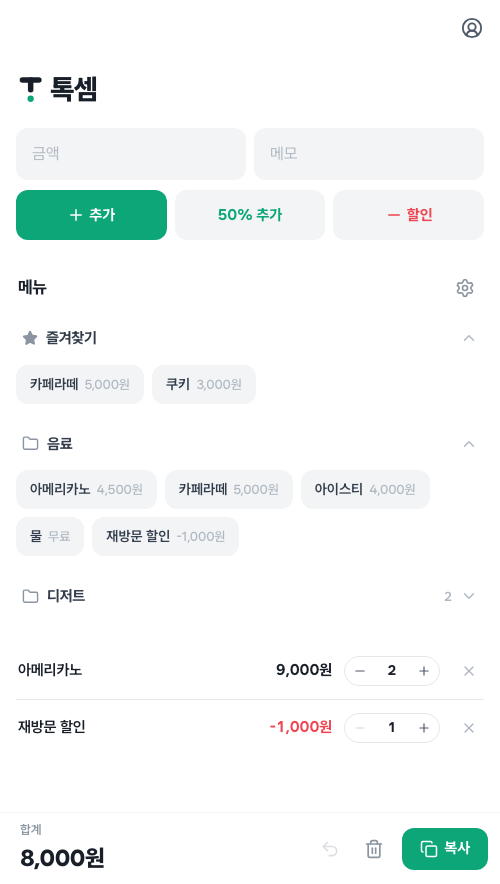

# 톡셈 (Toksum)

**톡톡 눌러 셈한다** — 미리 등록한 항목을 눌러 빠르게 견적을 만들고 복사하는 모바일 우선 견적기(PWA).
"Tok"(톡톡 누르기) + "sum"(셈·합계).

🌐 **라이브 데모: https://design-purim.github.io/toksum/**

  

## 주요 기능

- **빠른 견적** — 메뉴 칩을 눌러 항목 담기(같은 메뉴는 개수 합치기) · 개수 조절/직접 입력 · 직접입력(+추가) · 50% 추가 · 할인(−)
- **합계·복사** — 목록 전체 합계를 클립보드로 복사 · 실행취소 · 비우기. 견적이라 **합계는 0원까지만**(할인이 넘쳐도 마이너스로 안 감)
- **메뉴 관리** — 폴더별 메뉴 · **즐겨찾기(별)** 로 자주 쓰는 메뉴를 상단에 모아두기 · **무료 메뉴**·**할인 메뉴**(음수 금액) · 드래그 정렬 · 바텀시트 편집 · 금액 자동 콤마
- **로그인·동기화** — Google 로그인(Firebase) · 로그인하면 메뉴 설정이 여러 기기에 동기화(Firestore)
- **로그인 없이도** — 비회원은 즉시 사용(LocalStorage 저장)

## 기술 스택

HTML5 / CSS3 / **Vanilla JS(ES Modules, 빌드 도구 없음)** · Firebase Auth + Firestore · GitHub Pages 배포.
외부 의존성은 최소화했습니다 — 아이콘(Lucide)은 인라인 내장, 드래그(SortableJS)는 자체 호스팅, 폰트는 Wanted Sans. 디자인 톤은 토스를 참고했고, 메인 컬러는 에메랄드 그린입니다.

## 라이선스

© 2026 Purim. All rights reserved.

이 저장소는 **열람 목적으로만** 공개되어 있습니다. 코드·디자인의 사용, 복제, 수정, 배포, 재사용은 허가하지 않습니다. 자세한 내용은 [LICENSE](LICENSE)를 확인해 주세요.
